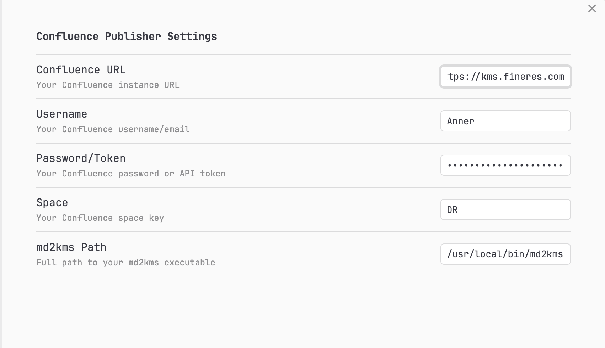
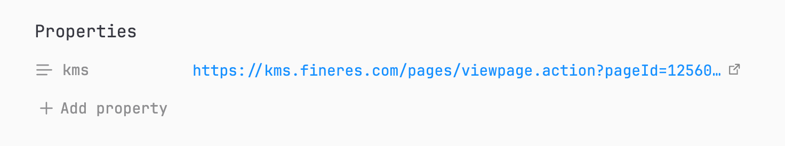
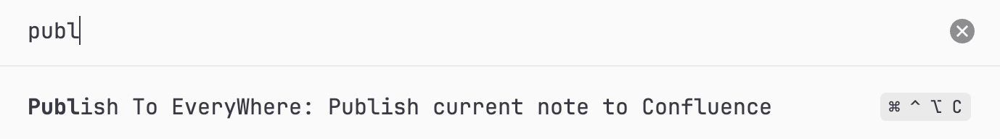
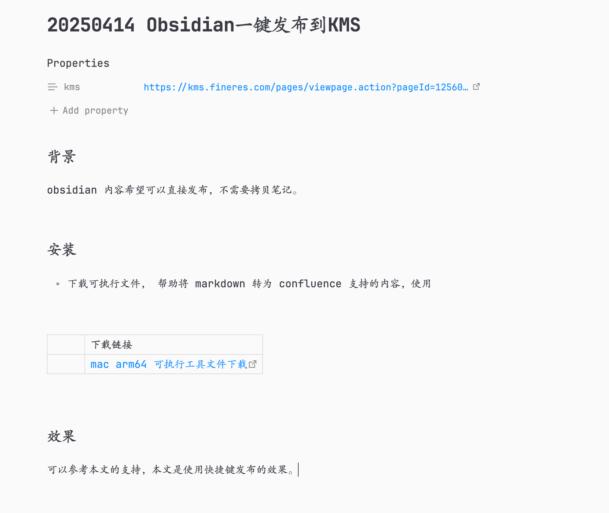
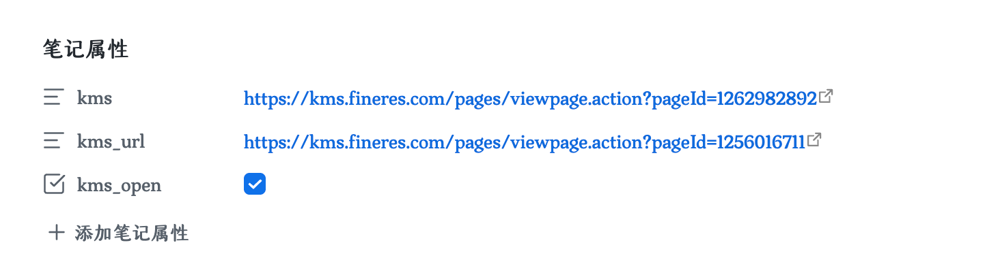
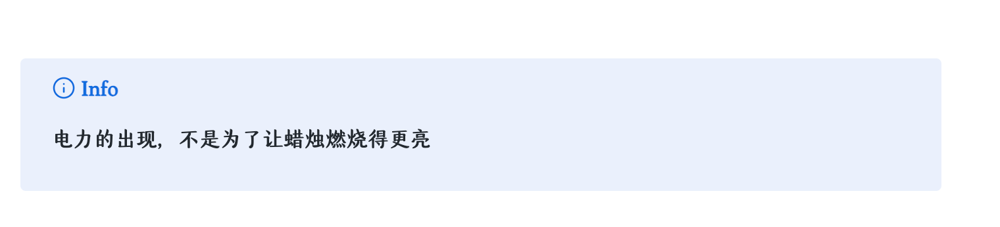

## 1 背景

obsidian 内容希望可以直接发布到 confluence中，不需要拷贝和同步自己的笔记。

## 2 安装

下载这个zip包，解压后放到 Vault 的 .obsidian/plugins/ 下面即可

[obsidian-publish-everywhere.zip](https://fine-build.oss-cn-shanghai.aliyuncs.com/test/obsidian-publish-everywhere.zip)

## 3 配置

URL 选择： https://kms.fineres.com

空间选择： DR （研发测试空间） ， 其他空间的Space名称可以在空间的首页找到。

用户名和密码配置好即可；

## 4 使用

### 4.1 步骤一： 添加父页面 kms 链接属性

在页面最上面，添加 obsidian 的文件属性 （cmd+;） ， 配置 kms 和对应的 **希望发布的父页面的URL**

### 4.2 步骤二： 配置发布的快捷键

配置快捷键，支持在当前的文档下一键发布。

### 4.3 步骤三： 测试发布

**如果这个页面的名称在对应的父页面下没有，会自动创建kms页面，避免我们手动创建了。**

如果对应的父页面下存在相同名称的页面，会直接按照最新的文档内容全文覆盖式更新。

发布成功后， 自动回填 kms_url 属性 （发布后的页面的 url）

## 5 功能介绍

### 5.1 基础的 markdown 格式全部兼容

可以参考本文的效果，本文是使用快捷键发布的效果，基础的格式都已经支持。 欢迎评论来需求。

### 5.2 目录宏与图片优化

自动添加 kms 右侧的目录结构；

如本文档的右侧目录所示；

### 5.3 支持 kms 权限控制

添加 obsidian 属性 kms_open ， 默认为 true ，加权限控制；

### 5.4 自动返回 kms_url 

发布后，自动获取发布页面的 url ， 回填到 obsidian 笔记的属性中

### 5.5 支持 excaldraw 插件自动渲染

如果 obsidian 安装了 excaldraw 插件 画图， 支持自动发布的时候直接渲染为图片自动发布到 kms

### 5.6 支持高亮块

支持类似：

的原生 obsidian 高亮块 转为 kms 高亮块；

### 5.7 支持修改标题

如属性存在 kms_url ,  则以 kms_url 的优先级最高， 支持修改标题并更新；

### 5.8 支持文字高亮

如 ：**测试高亮**

若 obsidian 安装 [Highlightr 插件](https://pkmer.cn/Pkmer-Docs/10-obsidian/obsidian%E7%A4%BE%E5%8C%BA%E6%8F%92%E4%BB%B6/highlightr-plugin/) 高亮后， 支持在 kms 显示对应的颜色；

### 5.9 支持图片尺寸修改

默认发布的图片是 500x500 尺寸； 如本页面的截图效果；

支持 Obsidian 的图片尺寸修改语法；

