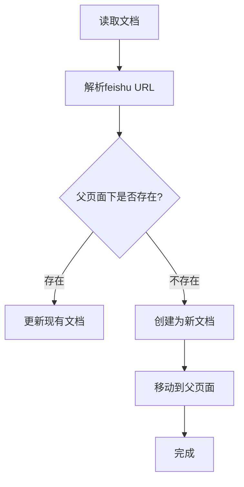

# 飞书API调用顺序测试

## 当前API调用流程



## 需要验证的关键点

1. **父页面是否可接受子文档**
   - 节点类型: origin
   - has_child: false
   - 需要提供父页面能否被设置为容器

2. **API调用顺序**
   - 创建文档的API
     - POST /drive/v1/files
     - response: object_token

   - 导入为飞书文档的API
     - POST /drive/v1/import_tasks
     - response: ticket

   - 查询导入结果的API
     - GET /drive/v1/import_tasks/:ticket
     - response: docx token

   - 移动到知识库的API
     - POST /wiki/v2/spaces/:space_id/nodes/move_docs_to_wiki
     - request: {obj_type: "docx", obj_token: "xxx", parent_wiki_token: "yyy"}
     - response: success

3. **可能的失败点**
   - 创建文档失败
   - 导入任务失败
   - 移动文档失败
   - Token无效

## 详细的API调用日志应包含

```javascript
// 1. 父页面信息
console.log("父页面:", {
  node_token: parentNodeToken,
  space_id: spaceId,
  title: parentTitle,
  node_type: nodeType,
  has_child: hasChild
});

// 2. 创建文档
console.log("1. 创建文档...", {filename: title});
console.log("   响应:", createResult);

// 3. 导入文档
console.log("2. 导入为飞书文档...", {file_token: fileToken});
console.log("   ticket:", importTicket);

// 4. 等待导入完成
console.log("3. 查询导入状态...", {ticket: importTicket});
console.log("   docx_token:", docxToken);

// 5. 移动到知识库
console.log("4. 移动到父页面...", {
  space_id: spaceId,
  obj_token: docxToken,
  parent_wiki_token: parentNodeToken
});
console.log("   移动结果:", moveResult);
```
